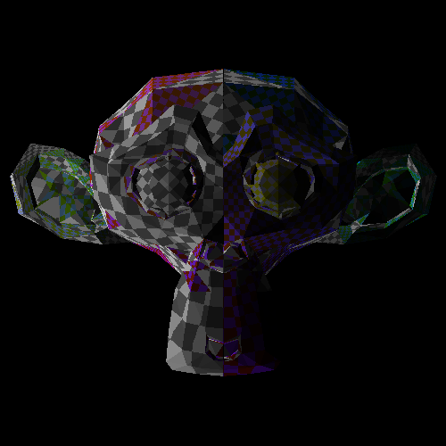

# meshing-around
`meshing-around` is a configurable rendering library for the [Uiua](https://uiua.org) language, with a goal of providing Uiuic methods for common rendering operations.

The library provides the following functionality:
- Mesh importing/exporting from/to Wavefront OBJ and STL files
- A `Suzanne` constant!
- Output of rendered normal, color, and lighting maps (and more)
- Generation of texture coordinates
- Material system supporting textures

**Want to jump right in?** Read the [guide](docs/guide.md)!

> It is recommended that you familiarize yourself with [data definitions](https://www.uiua.org/tutorial/Data%20Definitions) and [quaternion rotations](https://en.wikipedia.org/wiki/Quaternions_and_spatial_rotation).

## Getting started
To use the library, include the following at the top of your file:
```uiua
# Experimental!
M ~ "gh: Dguto9/meshing-around"
```
Create a `RenderConfig` with a resolution, and create a `Mesh` instance by importing from a 3D file format:
```uiua
M~RenderConfig 500_500
°M~OBJ &fras "assets/suzanne.obj"
```
With only these as arguments, calling `M~RenderMeshPreview` will yield an image result.

## A slightly less brief example
```uiua
# Experimental!
M ~ "gh: Dguto9/meshing-around"
~ "gh: Omnikar/uiua-math" ~ RQuat

RC ← M~RenderConfig
RO ← M~RenderOutput

RC 500_500

°M~OBJ &fras "assets/suzanne.obj"

°⊸M!Mesh~Transform≈Scale ↯3 0.7
°⊸M!Mesh~Transform≈Rotation RQuat ¯η 1_0_0

⧋⊂⧋÷⟜⇡⊸△◿₂⧋/+⇡100_100       # Rainbow tiles texture
⍉˙⊟₃°(-⊸¬)◿₂⧋/+⇡50_50        # Checker pattern
⊟∩M~Material                 # Make some materials
°⊸M~Mesh~Materials
⍜M~Mesh~MaterialIndex(◿₂⇡⧻)  # Assign materials to triangles

⤚M~RenderMesh        # This one does the rendering!
⊸RO~GenUVs           # Generate texture coordinates
RO~GenMatData        # Applies the textures
×⊃RO~Albedo RO~Light # Multiply color and lighting to get shading
&ims
```
> ### Some things to notice
> - [uiua-math](https://github.com/omnikar/uiua-math) quaternions are used for all rotations; you will be importing it often
> - Defining aliases like `RO` and `RC` is useful, but to remain explicit, these aliases will not be provided by the library

### Output


## What now?
- Try it out in the [pad](https://uiua.org/pad?src=0_19_0-dev_1__eJx1j09LAkEYxu_vpxjtogdzJCTqFhoRtGyO3ZepHXeHdmdtdwakwxAumAlBNyGCKITwVLeCDoHd6zu8nyS0PBR0fZ4fz58Vst3rilTGQmkeFcAhlhSDcJM0A6OTjWosslCqoMLTxCi_CD-uGyt5zNOqkYZXYq7DIrGkddIlrGW4BmANgoMr4lgmlC_SRqI6MgDm_lJdo7vmG65T6tUpBXBs25xypQTA7AlHL07BEVloD1Kusk6SxngxbB_xSODgcY3Q1fV_KZZormWiFqtwOF0MI59nhHrUq5GPZ1LzqEcBcHSL_RyHU-znJcc6XItU8mg2mU3KOLrHfr7P1U-NXdQskQzw8uaPtqt80Svh-G2eeX6HD69lAJxcLz_PYWCu3RHK4brJNYf3MY5y5tqt6FD4CWGu3ZNBqOELkZGloQ==)
- Skim the [docs](https://dguto9.github.io/meshing-around/)
- Read the [guide](docs/guide.md)