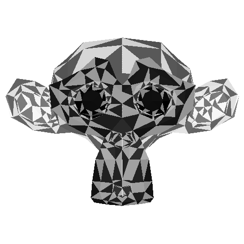
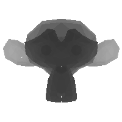
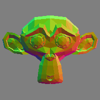
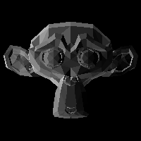
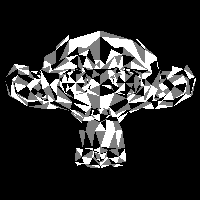
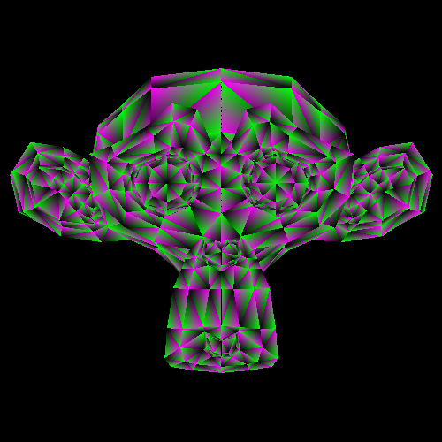
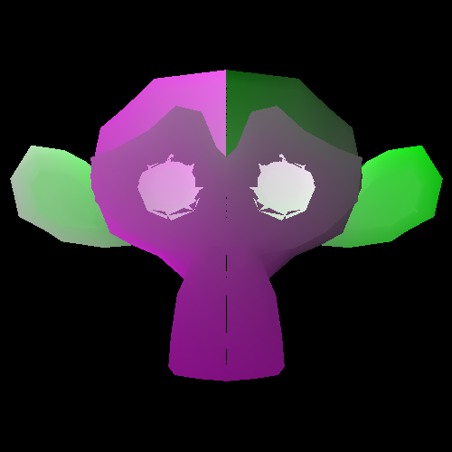

# Render outputs
This page is dedicated mainly to an explanation of the render process and the different maps which it provides.

## Mesh preparation
The first operations performed by the render functions prepare the triangles of the mesh to be displayed on the screen. The main steps of preparation include:
- Applying mesh transforms
    - The actual triangle coordinates are translated, scaled, and rotated, according to the `Mesh`'s `Transform` field.
- Transforming the triangles into view-space
    - The transformations described in the `Camera` field of `RenderConfig` are applied to the triangle coordinates in reverse, simulating the positioning of a camera in space.
- Backface culling
    - Triangles which face away from the `Camera` are removed from the render.
- Projection to the camera plane
    - Triangles are split into their first two coordinates, which define their screen-space position, and their depth away from the camera (the last coordinate).
- Depth resolution
    - Triangles are sorted based on their depth, such that ones further away are drawn first.
- Image-space scaling
    - The triangle coordinates are finally scaled such that `(-1, 1)`2 gets mapped to `(0, m)×(0, n)`, where m, n determine the output resolution.

## Index map
At the core of the rendering functions `meshing-around` supplies is the generation of the index map. This takes the set of triangles, sorted by closeness to the camera, and blits their index to an image, wherever the triangle is visible. Anywhere in the image where no triangle is present is valued at `∞`, for `⬚ fill` purposes.

> For the purpose of visualization, the indices here are divided to fit between 0 and 1. The index map will contain natural values between 0 and the number of triangles in the mesh.

The index map becomes useful when we want to place per-triangle data on each rendered triangle. To do this, we make use of `⊏ select` which substitutes per-triangle data into every location of the image by index. By using various `⬚ fill` values, we can also choose the background of each map.

Examples of this per-triangle data, mapped to the frame by the index map, are `Depth`, `MaterialIndex`, `Normal`, and `Light` values—which will be explored below.

## Depth map, normal map, light map, and material index
| Map | Description | Image | Map | Description | Image |
| --- | --- | --- | --- | --- | --- |
| Depth | How far from the camera is each pixel? |  | Normal | What spatial direction does each pixel point? |  |
| Light | How much is each pixel pointing toward the scene light? |  | Material Index | What material should each pixel use? |  |

Having these maps generated is already a great leap in the right direction. With a normal map, lighting by various lights can be determined. With the material index map, colors from each material can be selected to make the mesh colorful. Those results can even be multiplied together to get both shading and triangle colors!

## Relative coordinates (TriCoords)
The final map generated within the standard rendering process is significantly more complicated than the per-triangle data, but it opens up the door to determining per-pixel data for the render. This map provides two values for each pixel, which describe their position within the triangle. More specifically, it maps each pixel to its coordinate in the basis determined by the vectors pointing from the triangle's first vertex to the other two.
\
This map, alongside the index map, allows pixel values to be determined based on other triangles. This is particularly useful for texture coordinates. This, though, concludes the happenings within the standard rendering function, `RenderMesh`, as operations like generating texture coordinates are expensive, and therefore are optional to users.

## Generating texture coordinates

<!-- ## RenderOuput
`RenderOutput` is the second of the larger data definitions. It contains a series of images, all the same resolution, which describe triangle values mapped to view space (read: ).
Index: V~GreyscaleImg
    Depth: V~GreyscaleImg
    MaterialIndex: V~GreyscaleImg
    Normal: V~ColorImg
    Light: V~GreyscaleImg
    TriCoords: V~AlphaImg
    Ambient: V~ColorImg
    UVs: V~AlphaImg ← ↯1_1_2 ∞
    Pos: V~ColorImg ← ↯1_1_3 ∞
    Albedo: V~ColorImg ← ↯1_1_3 ∞
    Roughness: V~GreyscaleImg ← ↯1_1 ∞
    Reflectivity: V~GreyscaleImg ← ↯1_1 ∞

## RenderPreview
`Render ? Mesh RenderConfig`\
This function outputs only a lighting map, for a basic idea of how a mesh will appear in a full render. It is significantly faster than the full-featured `RenderMesh` function, and can run at 20 FPS at 500x500 resolution on my laptop. `RenderPreview` is currently not meant for multi-mesh rendering.

## RenderMesh
`RenderOutput ? Mesh RenderConfig`\
This is the usual function for generating renders. It outputs a `RenderOutput`. -->